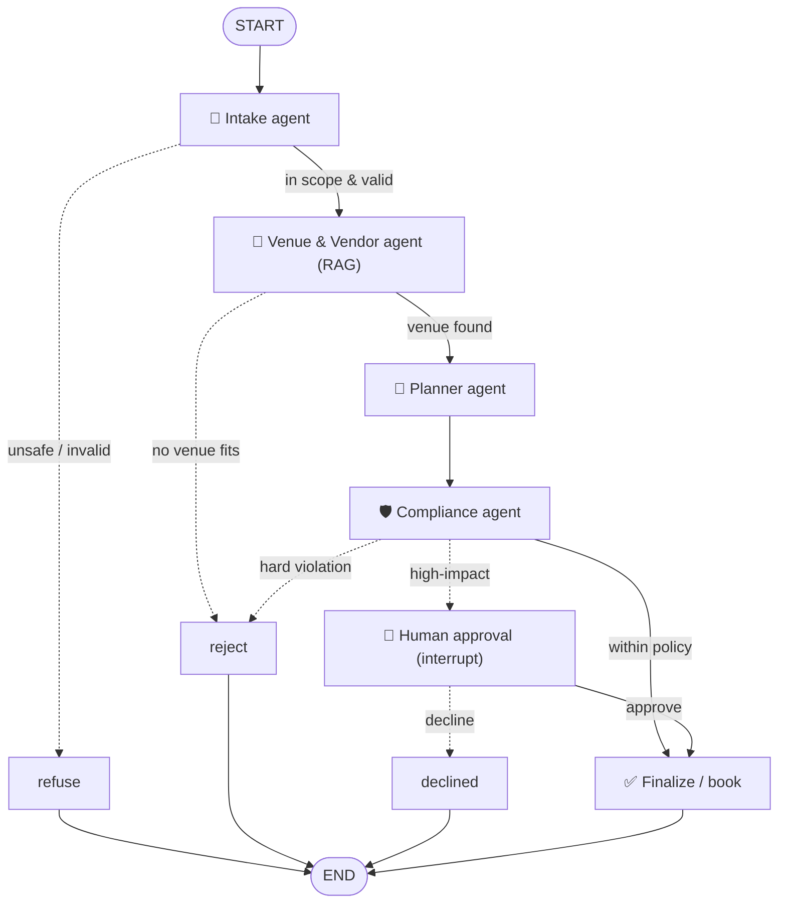

# 🎉 AI Event Planner — A Multi-Agent System (LangGraph)

A working multi-agent AI product that turns a plain-language event request
(*"plan a 150-guest wedding in Bangalore for ₹8 lakh on Dec 18, outdoor"*) into a
**costed, policy-checked event plan that a human approves before anything is booked.**

Built for the *Multi-Agent Orchestration* capstone. It is **not a chatbot** — it is
a team of four specialized agents wired together with **LangGraph**, with shared
state, real tools, RAG grounding, conditional routing, guardrails, human-in-the-loop
approval, observability, and an evaluation suite.

---

## 1. The problem & why it needs multiple agents

Planning an event is not one question — it is a **pipeline of different skills**:
understanding a messy request, researching venues/vendors against a catalog,
costing and scheduling, and checking everything against budget/safety policy
before committing money. A single prompt can fake this but can't do it reliably:
it hallucinates prices, ignores capacity limits, and has no safe "stop and ask a
human" step. We split the job into **four agents with distinct responsibilities**
and a shared state object, so each step is specialized, inspectable, and safe.

## 2. Architecture at a glance



### The four agents

| Agent | File | Responsibility | Output schema |
|-------|------|----------------|---------------|
| 🧾 **Intake** | `src/agents/intake.py` | Parse free text into a structured brief; first safety screen | `EventRequirements` |
| 🔎 **Venue & Vendor** | `src/agents/venue.py` | **RAG** search over the catalog, then select venue + vendors (prices verified from data) | `VendorShortlist` |
| 📅 **Planner** | `src/agents/planner.py` | Build the day timeline + exact budget (via the budget tool) | `EventPlan` |
| 🛡️ **Compliance** | `src/agents/compliance.py` | Deterministic policy/safety checks; decide auto-approve / escalate / reject | `ComplianceResult` |

## 3. How it satisfies every requirement

| Requirement | Where it lives |
|-------------|----------------|
| **3+ agents, distinct roles** | `src/agents/` — intake, venue, planner, compliance |
| **LangGraph orchestration** | `src/graph.py` — `StateGraph`, nodes, edges, compile |
| **Shared state across steps** | `src/state.py` — `PlannerState` flows through every node |
| **2+ tools / integrations** | `src/tools/` — RAG retriever, budget calculator, availability check |
| **Structured outputs (handoffs)** | `src/schemas.py` — Pydantic models; `llm.with_structured_output(...)` |
| **Routing / branching** | `src/graph.py` — 4 conditional edges (`route_after_*`) |
| **RAG / knowledge grounding** | `src/tools/retrieval.py` — embedded vendor catalog, semantic search |
| **Evaluation (5+ cases)** | `tests/test_cases.py` — 8 scenarios, all paths |
| **Observability / debugging** | `src/logging_utils.py` — step logs + `runs/trace-*.jsonl`; optional LangSmith |
| **Guardrails** | `src/guardrails.py` + compliance agent — safety screen, validation, policy checks |
| **Human-in-the-loop** | `src/graph.py` — `interrupt()` before booking high-impact plans |
| **Demo-ready** | `python -m src.app` runs end-to-end with sample input |

## 4. Setup (Windows / PowerShell)

> Python 3.12 and `git` are assumed installed. Commands use the `py` launcher.

```powershell
# 1. From the project folder, create and activate a virtual environment
py -m venv .venv
.\.venv\Scripts\Activate.ps1

# 2. Install dependencies
pip install -r requirements.txt

# 3. Add your API key
#    Copy .env.example to .env and paste your OpenAI key into it.
copy .env.example .env
notepad .env        # set OPENAI_API_KEY=sk-...
```

> **macOS / Linux:** `python3 -m venv .venv && source .venv/bin/activate && pip install -r requirements.txt`, then `cp .env.example .env`.

## 5. Run it

```powershell
# Interactive — it asks you for an event, then pauses for your approval
python -m src.app

# Or pass the request directly
python -m src.app "Plan a wedding in Bangalore for 150 guests, budget 8 lakh, on 2026-12-18, outdoor, need photography"

# Run the evaluation suite (8 scenarios)
python -m tests.test_cases
```

Every run also writes a full step-by-step trace to `runs/trace-<id>.jsonl`.

## 6. Project structure

```
multiagent-event-planner/
├── README.md                    # this file
├── requirements.txt
├── .env.example                 # copy to .env and add your key
├── data/knowledge_base/
│   └── vendors.json             # the catalog the RAG agent searches
├── src/
│   ├── app.py                   # CLI entry point
│   ├── runner.py                # run loop + human-approval pause/resume
│   ├── graph.py                 # the LangGraph: nodes, routing, HITL
│   ├── state.py                 # shared graph state
│   ├── schemas.py               # Pydantic handoff contracts
│   ├── guardrails.py            # deterministic safety/validation
│   ├── config.py / llm.py       # settings + model factory
│   ├── logging_utils.py         # observability
│   ├── formatting.py            # plan rendering
│   ├── agents/                  # the 4 agents
│   └── tools/                   # RAG retriever, budget, availability
├── tests/test_cases.py          # evaluation harness (8 scenarios)
└── docs/
    ├── ARCHITECTURE.md          # deep dive
    ├── PRESENTATION.md          # 10-minute talk script
    └── INDIVIDUAL_CONTRIBUTION_TEMPLATE.md
```

## 7. Notes

- **Security:** the API key lives only in `.env`, which is gitignored. Never commit it.
- **Cost:** uses `gpt-4o-mini` + `text-embedding-3-small` — a few US cents per full run.
- **Model is swappable:** change the provider in `src/llm.py` / `.env` to use a
  different LLM later; the rest of the system is unchanged.

See **`docs/ARCHITECTURE.md`** for the deep dive and **`docs/PRESENTATION.md`** for the demo script.
